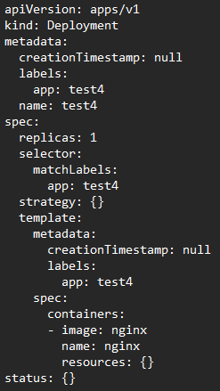

# YAML說明
## Brief
## 進行中
## Details
## Notes
## Steps
1. **kubectl create 方法**
    Ex
    ```
    kubectl create deployment test4 --image=nginx --dry-run=client -o yaml > test4.yaml
    ```
2. **yaml解釋**
    執行結果如圖
    
    
    ### k8s YAML說明
    YAML文件中包含以下字段：
    - `apiVersion`: 定義API版本。
    - `kind`: 資源類型，例如Deployment, Service等。
    - `metadata`: 元數據，包括名稱、命名空間、標籤等。
    - `spec`: 規範資源的期望狀態，例如容器映像、複製數等。
        